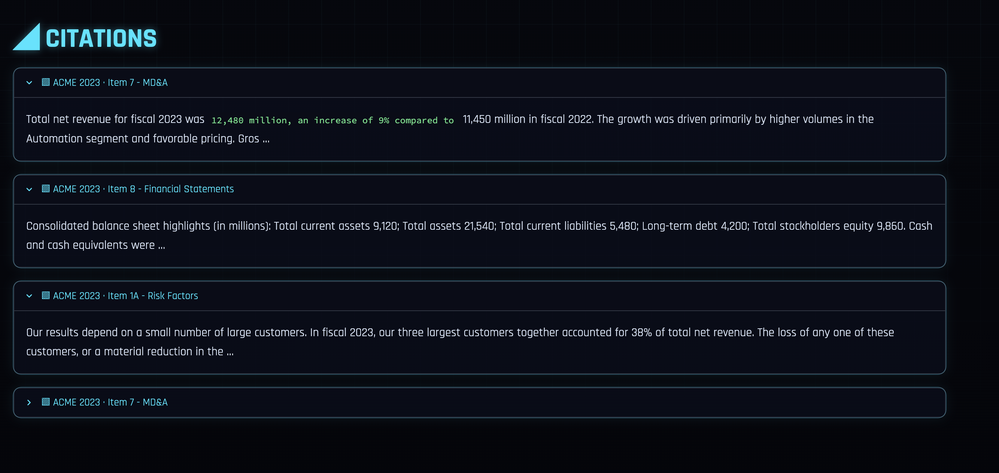
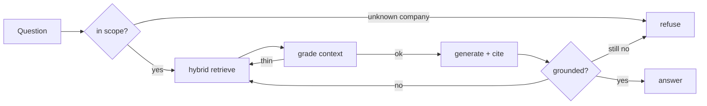

# Attest.AI : Agentic Finance RAG

A question-answering system over SEC filings. Ask it about a company's revenue,
margins or risk factors and it returns an answer with citations — or refuses when
it can't back the answer up with the filings it has. It's built as a small
LangGraph agent, so it grades its own retrieved context, retries when that
context is thin, and checks the answer is grounded before returning it.

Runs fully offline with no API key (`FINRAG_PROVIDER=offline`), so it's easy to
clone and try. Swap in OpenAI, Azure or Anthropic to run on real models.

## Screenshots

A grounded answer, with the guardrail scores and cost:


Each answer shows its citations — which filing and section every claim came from:



Ask about a company that isn't loaded and it refuses instead of inventing numbers:


## How it works



- **Hybrid retrieval** — dense embeddings + BM25, fused with Reciprocal Rank
  Fusion, pre-filtered by company/year/section metadata (SQL on pgvector).
- **Two guardrails** — an entity-scope check before retrieval, and a groundedness
  check after generation. Either can send the query to a refusal.
- **Evaluation** — Ragas + DeepEval metrics (faithfulness, answer relevancy,
  context recall) run in CI and fail the build if they regress.

## Run it

```bash
pip install -r requirements.txt
pip install -e .

make test    # tests + eval gate
make ui      # Streamlit demo on :8501
make api     # FastAPI on :8000
```

Point it at real filings:

```bash
export EDGAR_UA="Your Name your@email.com"
python scripts/fetch_edgar.py --ticker AAPL --year 2023 --out data/aapl_2023.jsonl
FINRAG_CORPUS_PATH=data/aapl_2023.jsonl make ui
```

## Stack

Python · LangGraph · LangChain · pgvector · FastAPI · Streamlit · Ragas ·
DeepEval · Docker · GitHub Actions

## Note

The bundled sample data uses fictional companies so the offline demo is
self-contained. `scripts/fetch_edgar.py` pulls real 10-K filings from SEC EDGAR.
