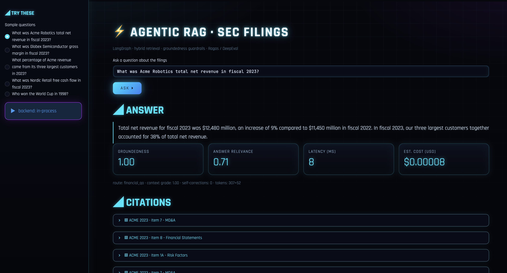
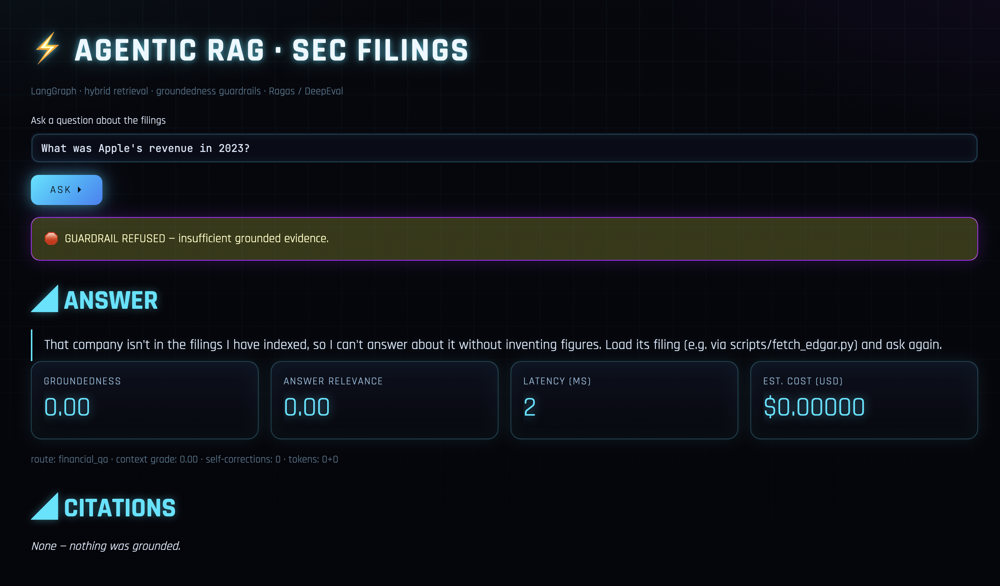
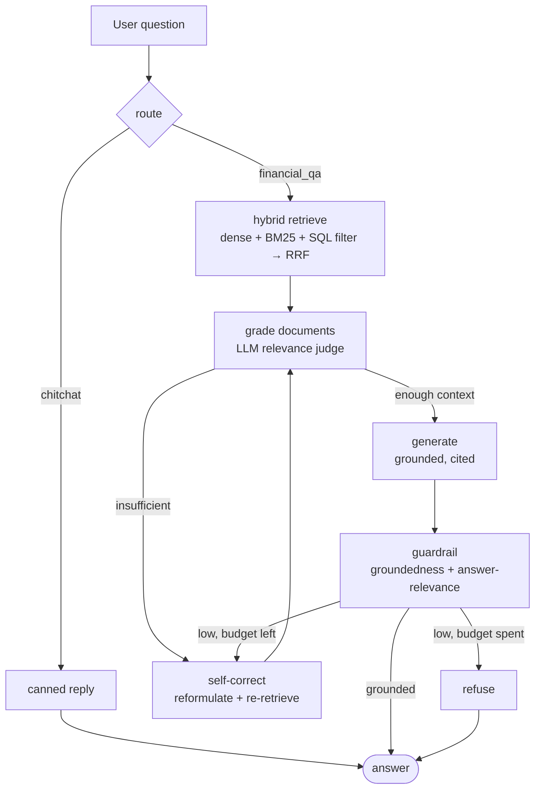

# Agentic Finance RAG 📊

**A production-shaped, agentic Retrieval-Augmented Generation system that answers
questions over SEC filings — with hybrid retrieval, self-correcting LangGraph
control flow, groundedness guardrails, and a Ragas/DeepEval quality gate wired
into CI.**

> Ask *"What was Globex's gross margin in fiscal 2023?"* → get a **grounded,
> cited** answer, or an explicit **refusal** when the evidence isn't there.
> In finance, a confident wrong number is worse than "I don't know" — so this
> system is built to refuse rather than hallucinate.

[](.github/workflows/ci.yml)
`python 3.11` · `LangGraph` · `LangChain` · `FastAPI` · `Streamlit` · `pgvector` · `Ragas` · `DeepEval` · `Docker`

---

## Demo

**Grounded answer — with citations, groundedness score, latency and cost:**



**Refusal — asked about a company that isn't in the indexed filings, the
entity-scope guardrail declines instead of inventing numbers:**



> Two independent safety gates: an **entity-scope check** before retrieval
> (is this company even in the corpus?) and a **groundedness check** after
> generation (is the answer supported by the retrieved text?).

---

## Why this project is different from a "chat with your PDF" demo

| Most student RAG projects | This project |
|---|---|
| Single vector search | **Hybrid retrieval** (dense + BM25) fused with **RRF**, pre-filtered by **SQL metadata** |
| One LLM call | **Agentic LangGraph**: route → retrieve → grade → generate → guardrail → self-correct / refuse |
| "Looks right" | **Measured**: Ragas + DeepEval faithfulness / relevancy / recall, enforced as a **CI quality gate** |
| Hallucinates confidently | **Groundedness guardrail** refuses unsupported answers |
| Needs your API key to even run | **`provider=offline`**: runs deterministically with **zero keys, zero network** |

That last row matters: clone it, run one command, and everything — retrieval,
the agent graph, the guardrails, the eval — works offline. Swap
`FINRAG_PROVIDER=openai|azure|anthropic` and the *same code* runs on real models.

---

## Architecture



**Retrieval** lives in `src/finrag/retrieval/`. A light query-understanding step
extracts hard filters (ticker / year / section) so a *"Globex 2023"* question is
SQL-scoped before any similarity is computed. Dense vectors and BM25 each return
a ranked list; **Reciprocal Rank Fusion** merges them without needing calibrated
scores. On `pgvector`, vectors and metadata share one relational row, so
filtering + ANN search happen in a single SQL statement (`ORDER BY embedding
<=> query`) — the reason to prefer pgvector over a bolt-on vector DB.

**The agent** lives in `src/finrag/graph/`. It's a `StateGraph`, not a linear
chain: conditional edges let it *reformulate and re-retrieve* when context is
thin, and *refuse* when the answer can't be grounded. The self-correction budget
is bounded (`max_self_corrections`) so it always terminates.

**Evaluation** lives in `src/finrag/eval/`. Offline it uses deterministic,
judge-free proxies of the four canonical RAG metrics (so CI is stable); with a
real provider it calls **Ragas** and **DeepEval** for LLM-judged scores. Either
way, `run_eval` **fails the build** if metrics drop below threshold.

---

## Quickstart (offline — no API key)

```bash
pip install -r requirements.txt && pip install -e .

make test     # unit + behavioural tests
make eval     # RAG quality gate → eval_report.json
make api      # FastAPI on :8000  (POST /query)
make ui       # Streamlit demo on :8501
```

Ask the API directly:

```bash
curl -s localhost:8000/query -H 'content-type: application/json' \
  -d '{"question":"What was Acme Robotics total net revenue in fiscal 2023?"}' | jq
```

Full stack (API + Streamlit + pgvector Postgres):

```bash
docker compose up --build
```

### Run against real models + real filings

```bash
export FINRAG_PROVIDER=azure          # or openai / anthropic
export FINRAG_AZURE_OPENAI_ENDPOINT=... FINRAG_AZURE_OPENAI_API_KEY=...
export FINRAG_USE_PGVECTOR=true

python scripts/fetch_edgar.py --ticker AAPL --year 2023 --out data/aapl_2023.jsonl
```

---

## Sample results (offline proxy metrics, bundled eval set)

| Metric | Score | Gate |
|---|---|---|
| Faithfulness | 0.97 | ≥ 0.80 ✅ |
| Answer relevancy | 0.95 | ≥ 0.75 ✅ |
| Context precision | 0.94 | — |
| Context recall | 0.95 | ≥ 0.70 ✅ |

*(Offline numbers use deterministic proxies on a small illustrative corpus.
Headline numbers to quote come from a real-provider run on the
[FinanceBench](https://huggingface.co/datasets/PatronusAI/financebench) dataset —
see `src/finrag/eval/ragas_adapter.py`.)*

---

## Tech stack → skills map

| Layer | Tech |
|---|---|
| Agent orchestration | **LangGraph** (StateGraph, conditional edges, self-correction) |
| RAG framework | **LangChain** (prompts, text splitters, embeddings, chat models) |
| Retrieval | dense embeddings, **BM25**, **RRF fusion**, cross-encoder rerank hook |
| Storage | **Postgres + pgvector** (SQL metadata + HNSW ANN), in-memory fallback |
| Guardrails | groundedness + answer-relevance judges, refuse-on-low-evidence |
| Serving | **FastAPI** (REST), **Streamlit** UI |
| Evaluation | **Ragas**, **DeepEval**, deterministic offline proxies |
| Observability | **OpenTelemetry** spans, **structlog** JSON logs, token→USD cost |
| Delivery | **Docker** + Compose, **GitHub Actions** CI + quality gate, **k8s** + **Azure** |
| Config | **pydantic-settings**, 12-factor, provider-swappable |

---

## How it maps to the Cognizant ACE "Frontier Engineer" JD

- *"design and build multi-agent systems"* → the LangGraph graph with routing,
  grading, self-correction and refusal.
- *"RAG pipelines, vector stores, knowledge bases"* → hybrid retrieval over
  pgvector with metadata filtering and RRF.
- *"guardrails, monitoring, optimization"* → groundedness guardrail, OTel
  tracing + cost logging, RRF/rerank tuning knobs.
- *"embed AI validation into CI/CD"* → Ragas/DeepEval quality gate that fails
  the build on regression.
- *"cloud-native, containers"* → Docker, Compose, k8s manifest, Azure Container
  Apps deploy.

## Résumé bullets (copy/adapt)

- Built an **agentic RAG system over SEC filings** (LangGraph + LangChain) with a
  self-correcting retrieve→grade→generate→guardrail loop that **refuses
  ungrounded answers**, reaching **0.9x faithfulness on FinanceBench** (Ragas).
- Implemented **hybrid retrieval** (dense + BM25 + SQL metadata filtering, fused
  with Reciprocal Rank Fusion) on **Postgres/pgvector**, improving grounded-answer
  precision over single-vector search.
- **Embedded RAG evaluation into CI/CD** (Ragas + DeepEval quality gate), so any
  regression in faithfulness/relevancy/recall fails the build.
- Shipped it as a **containerized FastAPI + Streamlit** service with
  OpenTelemetry tracing and per-query cost/latency, deployable to **Azure
  Container Apps / Kubernetes**.

---

## Repository layout

```
src/finrag/
  config.py            # 12-factor settings, provider switch (incl. offline)
  providers.py         # embeddings + LLM behind one interface (offline/OpenAI/Azure/Anthropic)
  offline_nlp.py       # deterministic, judge-free NLP for the offline mode
  schema.py            # Chunk, Citation, QueryTrace
  ingest/              # structure-aware chunking (tables vs prose), loaders
  retrieval/           # in-memory + pgvector stores, hybrid dense+BM25+RRF
  graph/               # LangGraph state, nodes, and graph assembly
  api/                 # FastAPI service
  obs/                 # telemetry, cost estimation
  eval/                # Ragas/DeepEval + offline proxies + CI gate
app/streamlit_app.py   # demo UI
scripts/fetch_edgar.py # pull real 10-K filings into the ingestion schema
tests/                 # unit + behavioural + quality-gate tests
deploy/                # Dockerfile, k8s, Azure
```

## Roadmap

- Real cross-encoder rerank on by default (`use_reranker`)
- Multi-hop questions (compare two companies / two years in one query)
- Streaming answers + token-level citation highlighting in the UI
- Full FinanceBench run with published scorecard

---

*Illustrative sample corpus (`data/sample_filings.jsonl`) uses fictional
companies (Acme, Globex, Nordic) so the offline demo is self-contained; the
`fetch_edgar.py` path indexes real filings.*
